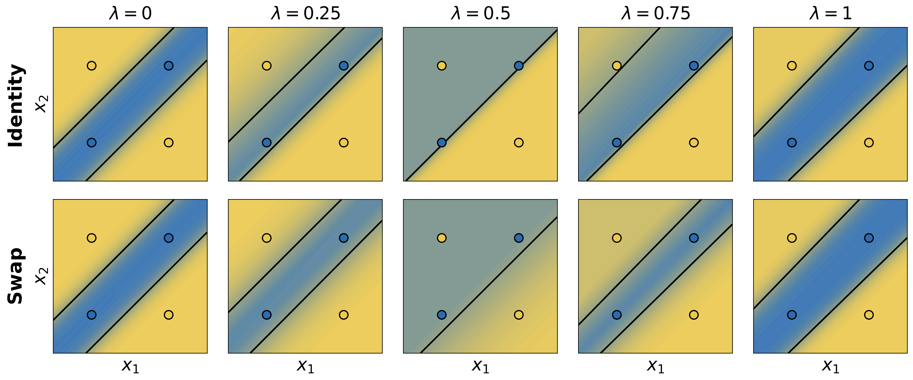
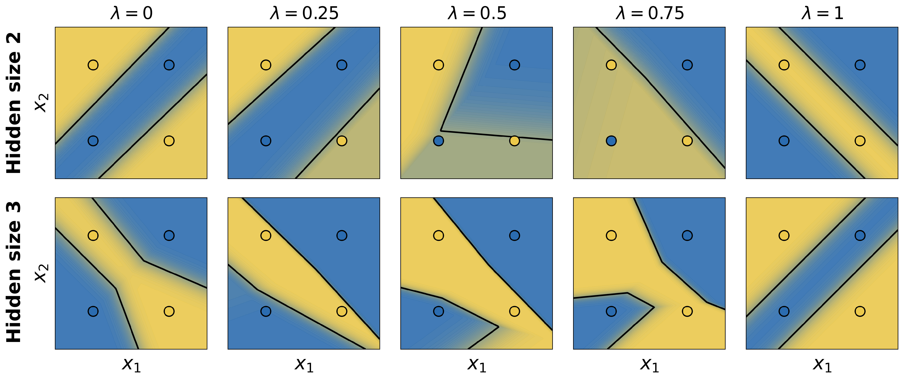
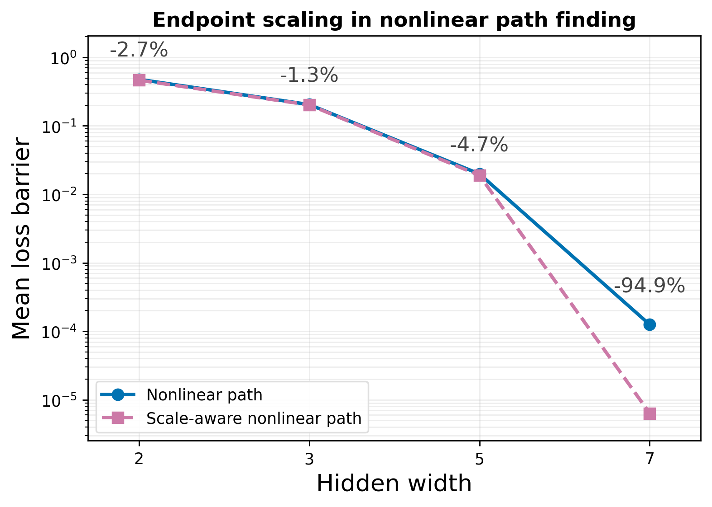
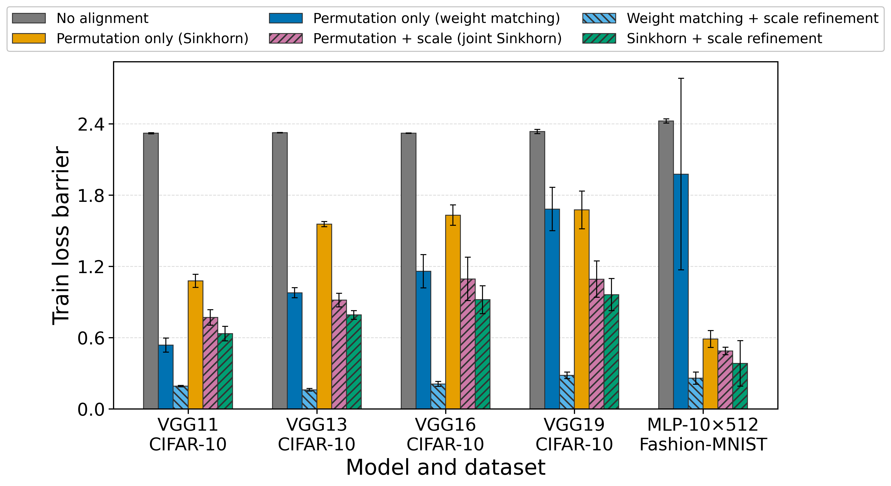

# The Role of Scaling Symmetries in Linear and Nonlinear Mode Connectivity of Neural Networks

This is the official reproducibility repository for the paper **“The Role of
Scaling Symmetries in Linear and Nonlinear Mode Connectivity of Neural
Networks.”** It contains the code, frozen configurations, and documentation
needed to reproduce the paper's experiments and reported results.

## Overview

Are independently trained neural networks separated by genuine loss barriers,
or do they only appear disconnected because their hidden units use different
coordinates? We study this question first in small ReLU networks trained on
XOR, where every hidden-unit permutation can be enumerated, and then in
VGG11/13/16/19 on CIFAR-10 and a 10-layer, width-512 MLP on Fashion-MNIST.

The experiments distinguish two mechanisms:

- **Symmetry** selects functionally equivalent parameter representatives.
  Besides neuron permutations, positive ReLU scaling can further reduce an
  interpolation barrier without changing either endpoint's function.
- **Redundancy** supplies routes through parameter space. Wider networks can
  admit low-loss nonlinear paths that are unavailable to capacity-tight
  networks, even after symmetry alignment.

## Key results

### Permutation symmetry alone does not guarantee connectivity

At the minimal XOR width of two hidden units, the complete symmetry class has
only two permutations. Under both full-batch gradient descent and minibatch
SGD, only **6 of 28** independently trained endpoint pairs preserve perfect
classification along their best-permuted linear interpolation; **22 of 28
pairs fail under every permutation**. The failure therefore cannot be
attributed to an approximate alignment algorithm.



*A representative width-2 failure. Both endpoints solve XOR, but neither the
identity nor swapped hidden-unit ordering preserves correct classification
along the linear path.*

### Positive scaling improves even the exhaustive best permutation

For widths 3, 5, and 7, we first enumerate every permutation and select the one
with the smallest sampled loss barrier. Holding that permutation fixed and
optimizing only function-preserving positive scales reduces the barrier on
**all 67 evaluated endpoint pairs**, lowering the mean by **31–78%**.

| XOR hidden width | No alignment | Exhaustive permutation | Exhaustive permutation + scale |
|---:|---:|---:|---:|
| 3 | 0.780 ± 0.610 | 0.357 ± 0.309 | **0.247 ± 0.283** |
| 5 | 0.608 ± 0.465 | 0.111 ± 0.118 | **0.025 ± 0.044** |
| 7 | 0.331 ± 0.184 | 0.023 ± 0.015 | **0.005 ± 0.003** |

Values are mean ± standard deviation of the interpolation-loss barrier across
endpoint pairs; lower is better. The complete comparison, including Sinkhorn
baselines and joint permutation–scale optimization, is reported in Table 1 of
the paper.

### Width enables nonlinear paths; scaling refines them

Optimized polygonal and quadratic Bézier paths do not recover nontrivial
low-loss connections for the difficult width-2 XOR pairs. At width 3, all
studied pairs admit low-loss paths that retain 100% accuracy. Scaling the
endpoints does not remove the width-2 obstruction, but lowers the mean
nonlinear-path barrier at every tested width above two.



*Representative optimized quadratic Bézier paths. The width-2 path crosses a
high-loss region, while the width-3 network has enough redundancy to maintain
the XOR solution along the learned path.*



*Mean polygonal-path barrier with and without positive scaling of both
endpoints. Scaling helps once sufficient architectural capacity is available.*

### The scaling benefit transfers to larger networks

Across all five architecture–dataset settings, refining a weight-matched
permutation with positive scales reduces the mean **training-loss barrier by
64–87%**. Under the paper's standardized search grid, weight matching followed
by scale refinement performs best in every setting, although no reported
configuration removes the sampled training-loss barrier entirely.

| Training-loss barrier | VGG11 | VGG13 | VGG16 | VGG19 | MLP-10×512 |
|---|---:|---:|---:|---:|---:|
| Weight matching | 0.536 | 0.976 | 1.157 | 1.681 | 1.976 |
| Weight matching + scale | **0.191** | **0.159** | **0.209** | **0.281** | **0.258** |

Each value is the mean over three disjoint independently trained endpoint
pairs. VGG models use CIFAR-10; the MLP uses Fashion-MNIST.



*Training-loss barriers across the larger architectures. Error bars show the
sample standard deviation over three endpoint pairs.*

## Conclusions

- Permutation symmetry is an important but incomplete explanation of neural
  network mode connectivity.
- Positive scaling and permutation are complementary: scale refinement can
  find better functionally equivalent representatives even after exhaustive
  permutation search.
- Symmetry and capacity are not interchangeable. Scaling can make a path
  easier to express or optimize, but it cannot supply representational freedom
  missing from a narrow architecture.
- The exact negative result comes from controlled XOR networks. The
  larger-network study is non-exhaustive and uses three endpoint pairs per
  architecture, so its conclusions are evidence of transfer rather than a
  universal architectural claim.

## Reproducing the experiments

The repository reproduces four reported experiment groups:

1. exhaustive permutation tests for width-2 XOR networks, including the minibatch-SGD robustness check;
2. exhaustive permutation and positive-scale alignment for XOR widths 3, 5, and 7;
3. nonlinear polygonal and quadratic Bézier paths, with and without endpoint scaling;
4. final-endpoint alignment for VGG11/13/16/19 on CIFAR-10 and a 10-layer, width-512 MLP on Fashion-MNIST.

The exact paper-to-code/result mapping and end-to-end commands are in [REPRODUCIBILITY.md](REPRODUCIBILITY.md).

## Installation

Python 3.10 or 3.11 and Poetry are supported.

```bash
poetry install
PYTHONPATH=.:src poetry run pytest -q
```

The lockfile is committed. XOR data are generated in code. CIFAR-10 and Fashion-MNIST are downloaded through `torchvision`; no private data or pretrained checkpoints are required. Vendored third-party code and pinned revisions are documented in [THIRD_PARTY_LICENSES.md](THIRD_PARTY_LICENSES.md).

## Quick checks

Run the CPU-only XOR smoke suite:

```bash
bash ops/local/smoke/run_xor_smoke_suite.sh
```

Inspect cluster commands without submitting jobs:

```bash
bash ops/slurm/training_stage/submit_endpoints.sh --dry-run \
  output_root=results/training_stage_vgg11_final model=VGG11

bash ops/slurm/dense_linear_stage/submit_all.sh --dry-run \
  --config-name dense_linear_stage/final_vgg11
```

## Layout

- `experiments/`: thin runnable entry points for the paper experiments.
- `configs/experiments/`: frozen scientific configurations and XOR search grids.
- `src/mode_connectivity/`: reusable training, alignment, evaluation, and reporting code.
- `ops/`: local smoke tests and resumable Slurm launchers.
- `tools/plotting/`: scripts that regenerate every empirical paper figure.
- `tests/`: unit, import, config-composition, and shell-syntax checks.
- `external/`: vendored upstream dependencies.
- `results/`: retained reported artifacts in this working copy (ignored for normal Git commits).
- `archive/`: historical code and non-paper results; nothing there is imported by active code.
- `docs/readme-assets/`: the key paper figures displayed in this README.

The historical module name `dense_linear_stage` now contains only the paper's
final-endpoint alignment workflow; the cross-training-stage mode has been
removed from the active tree. Generated datasets, checkpoints, results, plots,
and new manuscript build artifacts are intentionally ignored by Git. Existing
tracked manuscript sources remain tracked. Use a new `output_root` whenever a
scientific configuration changes; the cluster pipelines freeze a protocol hash
and reject incompatible reuse.
